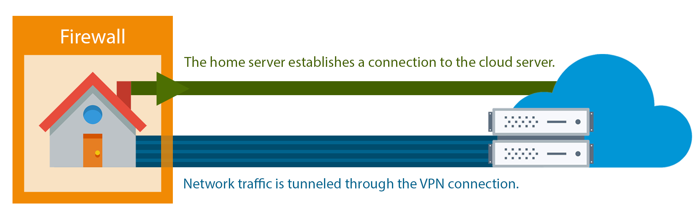

# Tinc Configuration

[Tinc](https://www.tinc-vpn.org/) allows us to access a server behind a firewall with a non-static IP address by creating a VPN with a another server that has a static IP address. Here we will use an EC2 instance as the host and a Raspberry Pi behind any home network.



## Install tinc
```
sudo apt-get update
sudo apt-get install tinc
```

### Configuration
Tinc uses a netname to distinguish one VPN from another. We will call our VPN `pi-net`.

Each server has 3 components:
- Config files: `tinc.conf`, `tinc-up`, and `tinc-down`.
- Public/private key pairs
- Host config files: contain public keys and addresses


## Cloud Server
AWS EC2 with static IP (Elastic), an __open port 655__, and `tinc` installed.

Create the configuration directory
```
sudo mkdir -p /etc/tinc/pi-net/hosts
```

Create a config file `/etc/tinc/pi-net/tinc.conf` with the following:
```
Name = cloud
AddressFamily = ipv4
Interface = tun0
```

This creates a node called `cloud`. 

Next, create the `cloud` hosts configuration `/etc/tinc/pi-net/hosts/cloud`
```
Address = <cloud_public_ip>
Subnet = 10.0.0.1/32
```

Now generate the public/private keypair for this host with the following command:
```
sudo tincd -n pi-net -K4096
```

This creates the private key (`/etc/tinc/pi-net/rsa_key.priv`) and appends the public key to the cloud hosts configuration file that we recently created (`/etc/tinc/pi-net/hosts/cloud`).

Now, we create the `tinc-up` script `/etc/tinc/pi-net/tinc-up`
```
#!/bin/sh
ifconfig $INTERFACE 10.0.0.1 netmask 255.255.255.0
```
which will run when our VPN is started.

And the `tinc-down` script `/etc/tinc/pi-net/tinc-down`
```
#!/bin/sh
ifconfig $INTERFACE down
```
to remove the network interface when the VPN is stopped.

Finally, make the network scripts executable:
```
sudo chmod +x /etc/tinc/pi-net/tinc-*
```

## Home Server
Raspberry Pi with the latest version of Raspbian

Create the configuration directory.
```
sudo mkdir -p /etc/tinc/pi-net/hosts
```

And the config file `/etc/tinc/pi-net/tinc.conf`
```
Name = pi
AddressFamily = ipv4
Interface = tun0
ConnectTo = cloud
```

Here, we have named the node behind the firewall `pi` and configured it to connect to the `cloud` node.

Next, create the hosts configuration `/etc/tinc/pi-net/hosts/pi`
```
Subnet = 10.0.0.2/32
```

And generate key pairs:
```
sudo tincd -n pi-net -K4096
```

Startup script `/etc/tinc/pi-net/tinc-up`
```
ifconfig $INTERFACE 10.0.0.2 netmask 255.255.255.0
```

This IP address is how the node will be accessed on the VPN.

And the interface stop script `/etc/tinc/pi-net/tinc-down`
```
ifconfig $INTERFACE down
```

Lastly, make the network scripts executable:
```
sudo chmod +x /etc/tinc/pi-net/tinc-*
```

## Exchange keys between nodes

Now we need to copy the host configuration file from `pi` to `cloud` and vice versa, from `cloud` to `pi`. 

So that each node has the same files in `/etc/tinc/pi-net/hosts`.

One way to achieve this is `scp`, for example:

### `pi` ==> `local machine` ==> `cloud`
From `pi`, copy the `pi` host config to your local machine
```
sudo scp /etc/tinc/pi-net/hosts/pi user@local_machine_ip:/tmp
```

Then, copy it to `cloud` from your __local machine__:
```
scp /tmp/pi user@cloud_public_ip:/tmp
```

Finally, on `cloud` put in the appropriate directory:
```
cd /etc/tinc/pi-net/hosts; sudo cp /tmp/pi ./
```

### `cloud` ==> `local machine` ==> `pi`
From `cloud`, copy the `cloud` host config to your local machine
```
sudo scp /etc/tinc/pi-net/hosts/cloud user@local_machine_ip:/tmp
```

Then, copy it to `pi` from your __local machine__:
```
scp /tmp/cloud user@pi_public_ip:/tmp
```

Finally, on `pi` put in the appropriate directory:
```
cd /etc/tinc/pi-net/hosts; sudo cp /tmp/cloud ./
```

## Test configuration

On each node, start `tinc` in debug mode
```
sudo tincd -n pi-net -D -d3
```

From another terminal on `cloud` ping the `pi`:
```
ping 10.0.0.2
```

The ping should work fine, and you should see some debug output in the other windows about the connection on the VPN.

Now, you can use the VPN interfaces to do any other network communication like application connections, copying files, and SSH. 

Quit the daemon with `CTRL + \`

## Configure Tinc To Startup on Boot

On __each node__ create `/etc/tinc/nets.boot`
```
# This file contains all names of the networks to be started on system startup.
pi-net
```

Start tinc with the `service` command
```
sudo service tinc@pi-net start
```
